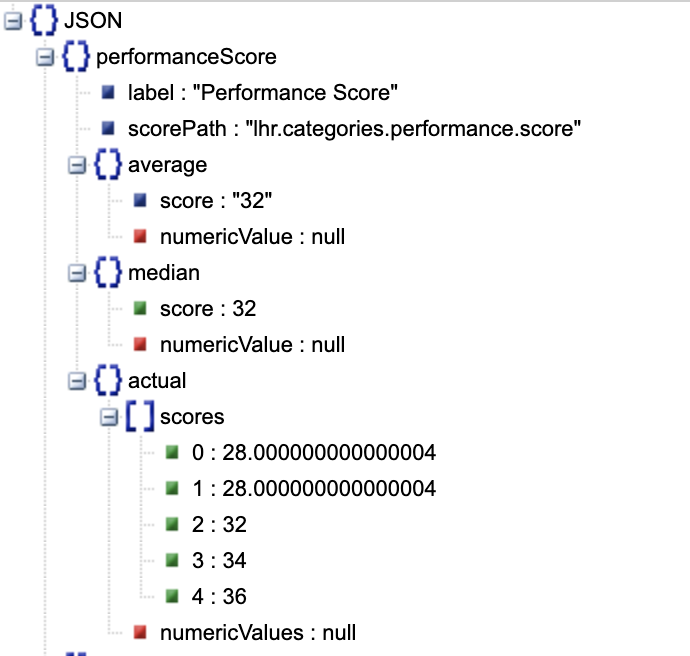

# howfast

[](https://circleci.com/gh/tallnerds/howfast)

A simple CLI for generating more accurate data from [Lighthouse](https://github.com/GoogleChrome/lighthouse/) reports.


## Installation

The easiest way to install is to globally install via npm.

```
npm install -g @tallnerds/howfast
```

## Usage

To see up to date usage, you can always run

```
howfast -h
```

Here is a typical example of hitting a site 5 times

```
howfast -s https://google.com -t 5
```

By default, this will also generate a json file with all of the metrics you would need to do more detailed analysis. Upon completing the runs, it will open this file automatically for you. By default, this file is stored in `/tmp`, but can be modifying with the `-f` flag

```
howfast -s https://google.com -t 5 -f ~/Downloads
```

Lastly, if you are creating a PR and want to quickly generate some markup, you can change the report type to html using the `--html` flag. This will give you a generated html file (rather than json) with the results displayed in different ways (json, markdown, etc).

```
howfast -s https://google.com -t 5 -f ~/Downloads --html
```

## Reports

There are 2 types of reports that can be generated from this tool: `json` and `html`.

### Json

The default report output is json. Here is the generate structure of the json file:

```json
{
  "metricName": {
    "label": "<[string] label>",
    "scorePath": "<[string] path to score in original lighthouse data>",
    "metricPath": "<[string] [optional] path to metric in original lighthouse data>",
    "average": {
      "score": "[number]",
      "numericValue": "[number]"
    },
    "median": {
      "score": "[number]",
      "numericValue": "[number]"
    },
    "actual": {
      "scores": "[array<number>]",
      "numericValues": "[array<number>]"
    }
  }
}
```

Here is a nice visual representation



## Contributing

### Re-render Usage Gif

We use a really neat-o tool for generating the console gif above. To re-render, simply re-record

```
terminalizer record terminal-demo
```

tweak the settings at `./terminal-demo.yml`

and record

```
terminalizer render terminal-demo
```
